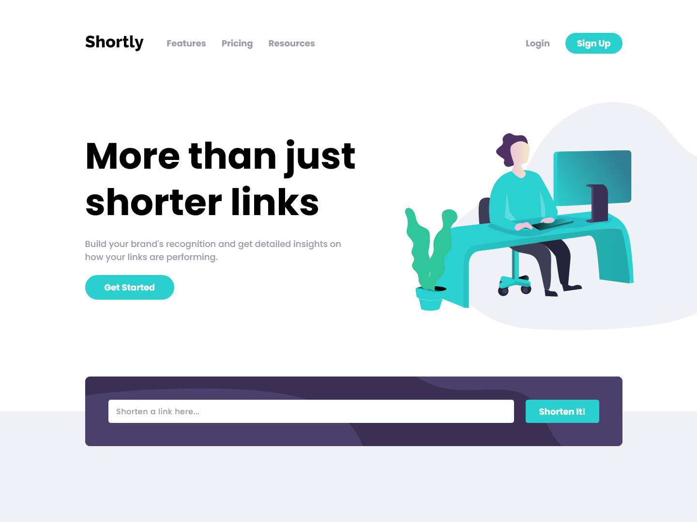

# Frontend Mentor - Shortly URL shortening API Challenge solution

This project comes from the [Shortly URL shortening API Challenge challenge on Frontend Mentor](https://www.frontendmentor.io/challenges/url-shortening-api-landing-page-2ce3ob-G). Along with the focus of API implementation, it has been altered to provide improved interpretation of vertical rhythm and typescales principles in the design.

## Table of contents

- [Frontend Mentor - Shortly URL shortening API Challenge solution](#frontend-mentor---shortly-url-shortening-api-challenge-solution)
  - [Table of contents](#table-of-contents)
  - [Overview](#overview)
  - [My process](#my-process)
    - [Built with](#built-with)
    - [Obervations](#obervations)
    - [Continued development](#continued-development)
  - [Author](#author)

**Note: Delete this note and update the table of contents based on what sections you keep.**

## Overview

This is a design-to-code project to showcase the use of implmenting an API for shortening URLs. Though the design contains links to suggest multiple pages, the design only focuses on a landing page with a form to submit a URL for shortening. Local storage and Vuex state management are combined for persisting and updating a rendered list of generated short URLs.

Users should be able to:

- View the optimal layout for the site depending on their device's screen size
- Shorten any valid URL
- See a list of their shortened links, even after refreshing the browser
- Copy the shortened link to their clipboard in a single click
- Receive an error message when the `form` is submitted if:
  - The `input` field is empty
  - (Other error messages are possible!)



Live Site URL: [https://tylerapfledderer.github.io/url-shortening-api/](https://tylerapfledderer.github.io/url-shortening-api/)

## My process

### Built with

- Semantic HTML5 markup
- CSS custom properties
- Flexbox
- Mobile-first workflow
- Local storage for persistence of generated shortened links
- [Vue 3](https://v3.vuejs.org/) - JS library
- [Vuex](https://next.vuex.vuejs.org/) - Vue State Management
- [ShrtCode](https://shrtco.de/) - URL shortening API
- Jest with vue-test-utils - Unit/Component testing

### Obervations

This is the first project where I took a deeper dive into Jest, primarily focusing on unit/component testing. Because Vuex is involved, some testing required mocking the store, such as updating the list of previously generated URLs by the user.

One fascinating challenge was offsetting the svg image in the hero section on the mobile screen, and maintaining this offset on the desktop while the layout changes. The deceptive part is allowing the image to flow out of view, such as in small mobile screens, while not creating a horizontal scroll and mainting padding for the other content in the container. This is simply achieved by using `overflow-x: hidden` on the `body` element. This property can not be applied to any child elements as the scroll will still be present, and it will only result in the image being cut off instead.

I decided with still project to be progressive in creating components, by deliberately building the structure and styling in the `App` component, then splitting up chunks as needed. This allowed for better awareness of the functionaility between parts, noticing where some styling served better globally, and overall allowed for easier refactoring as I generated components.

To help in UX, because all of the links present lead to nowhere due to the design only focusing on a landing page, I decided to create a toast to trigger a message on clicking any link. This required a wrapping div around all the sections of the page that simply handled a click event that searched for the "target" clicked link in the DOM to then generate the toast via a CSS animation attached to a class, local data to show the message, and creating a quick timeout before hiding the message with a different CSS class and animation.

```js
function handleDumbyLinkToast(event) {
  const { target } = event;
  if (target.tagName === 'A' && target.attributes.href.value === '#') {
    // Don't have the anchor force the user back to the top of the page
    event.preventDefault();

    toastClass.value = 'show-toast';
    toastMsg.value = 'Thank you for trying out the link, but unfortunately it leads to nowhere in this demo. :(';
    setTimeout(() => {
      toastClass.value = 'hide-toast';
      toastMsg.value = '';
    }, 3000);
    return;
  }
  return;
}
```

The toast is also used in relation to the API. For an unexplainable reason, when a user visits the page for the first time on any given day and tries to submit a url, the API takes almost a minute to return a response. This is certainly a UX issue without providing some change of state and a message for the user. A quick solution is to create a timeout prior to running the fetch in the async store action, where if the fetch takes too long to execute, then the necessary functionality will trigger. Whether or not this occurs, the timeout event is cleared after the fetch, and certain states to update the toast will be reset.

```js
// Inside the store action

// ...some previous code for loading state
const tooLongTimeout = setTimeout(() => {
  if (state.isLoading) {
    commit('SET_TOO_LONG_LOADING', true);
  }
}, 3000);

await fetch(`https://api.shrtco.de/v2/shorten?url=${inputUrl}`)
  .then((res) => res.json())
  .then(({ ok, error_code, result }) => {
    if (!ok) {
      // Set Server error info if the API return is invalid
      commit('SET_SERVER_ERROR', { hasErr: true, message: error_code });
      return;
    }
    const newUrl = { id: uuid.v1(), inputUrl, generatedUrl: result?.full_short_link };

    // Add Generated URL and Input Url to the array
    commit('ADD_URLS', newUrl);
    // Send to local storage
    const prevStorage = JSON.parse(localStorage.getItem('generatedUrls'));
    const newStorage = prevStorage ? [newUrl, ...prevStorage] : [newUrl];
    localStorage.setItem('generatedUrls', JSON.stringify(newStorage));

    // Ensure Server Error States are cleared
    commit('SET_SERVER_ERROR', { hasErr: null, message: '' });
  })
  .catch((err) => {
    console.error('Something went wrong: ', err);
    commit('SET_SERVER_ERROR', { hasErr: true, message: err.message });
  });

await commit('SET_TOO_LONG_LOADING', false);
clearTimeout(tooLongTimeout);

// ...some code to remove loading state
```

### Continued development

Within this project, accessibility will be addressed and improved on. This includes moving focus to the newly generated url listing after a successful URL submission, and triggering the screen reader of this change with any informative text for the user that they have changed location to the button for copying the resulting url. The other is triggering the screen reader to read the message in the toast while not having the user navigate away from their last location.

This project is the first of future projects to put attention to more basic tools and libraries, such as using Vue instead of Nuxt or vanilla CSS instead of Chakra. Future projects will look to use more primitive tooling to further display flexibility in the building within the portfolio.

## Author

- Website - [Tyler Pfledderer](https://tylerpweb.dev)
- Linkedin - [Tyler Pfledderer](https://www.linkedin.com/in/tyler-pfledderer)
- CodePen - [tylerapfledderer](https://codepen.io/tylerapfledderer)
